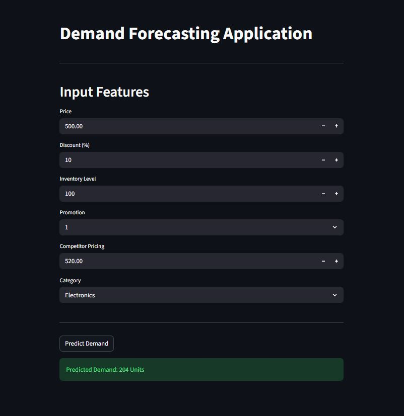

# Demand Forecasting with Machine Learning


Demand forecasting is an important task in the supply chain and retail industries as it helps organisations optimise inventory. This project explores machine learning techniques to help organisations make accurate demand predictions.



## Project Overview

This repository is an implementation of a demand forecasting pipeline that includes

- Data exploration and visualisation
- Data preprocessing and feature engineering
- Model development using machine learning
- Model evaluation using performance metrics
- Deployment through Streamlit, a web-based interactive application 

## Key Features

- Exploratory Data Analysis (EDA)  
- Data preprocessing and feature engineering  
- Machine learning model training  
- Model evaluation 
- Interactive prediction interface using Streamlit  

## Dataset

The dataset contains historical sales data, including features that influence product demand, such as:

`Date`, `Store ID`, `Product ID`, `Category`, `Region`,
`Inventory Level`, `Units Sold`, `Units Ordered`, `Price`, `Discount`,
`Weather Condition`, `Promotion`, `Competitor Pricing`, `Seasonality`,
`Epidemic`, `Demand`

## Machine Learning Model

The primary model used in this project is `XGBoost Regressor`, a powerful gradient boosting algorithm popularly used for predictive modelling.

## Streamlit Application

The repository includes a `Streamlit`, an interactive web based dashboard that allows users to generate demand predictions.

Features:

- Input feature
- View predicted demand

## Tools

- Python
- Pandas
- NumPy
- Scikit-learn
- Matplotlib
- Seaborn
- XGBoost
- Streamlit

## Installation

- Clone the repository
```bash
git clone https://github.com/comrade70/demand-forecasting.git
```

```bash
cd demand-forecasting
```

- Run the application locally

```bash
streamlit run app.py
```

## License

This project is licensed under the MIT License.

---

If you find this project useful, please consider starring ⭐ the repository.
